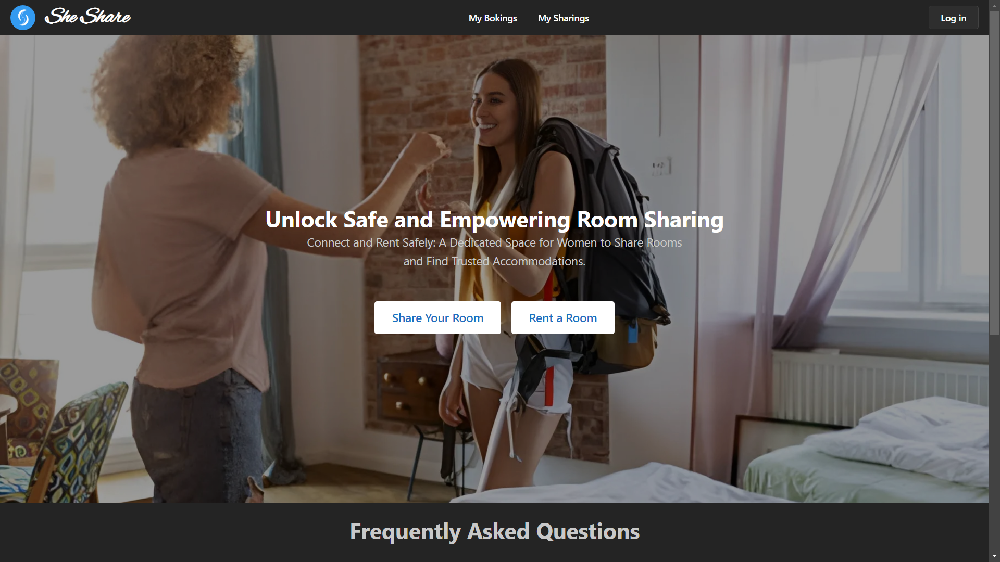
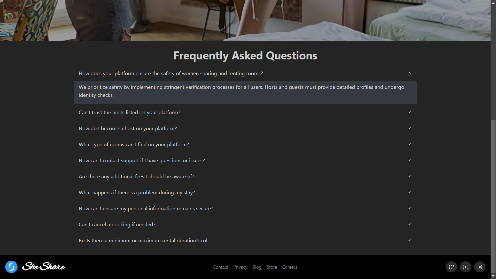
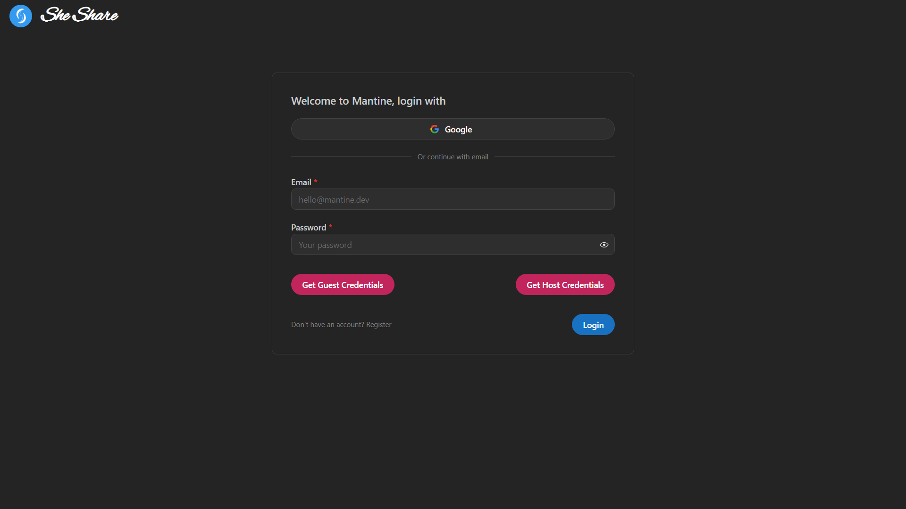
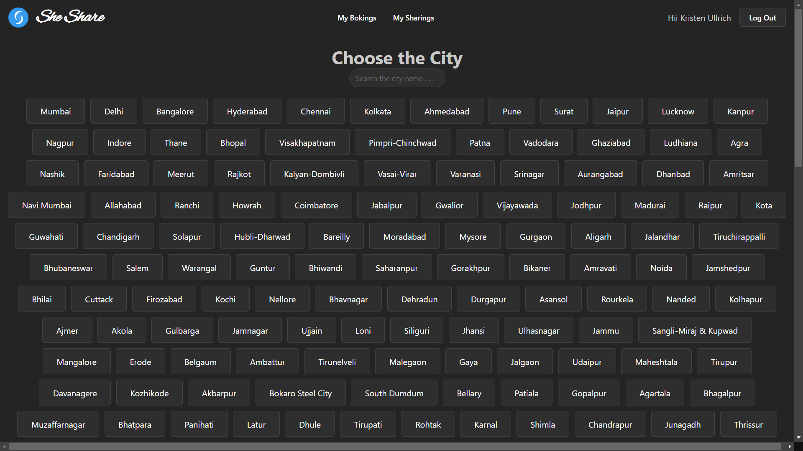
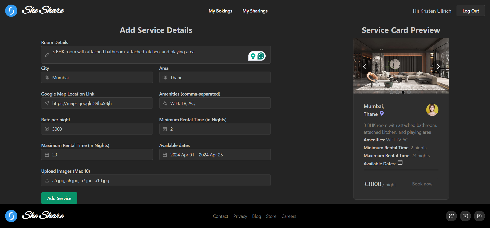
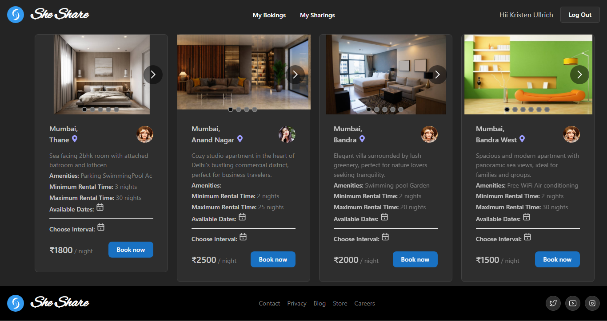
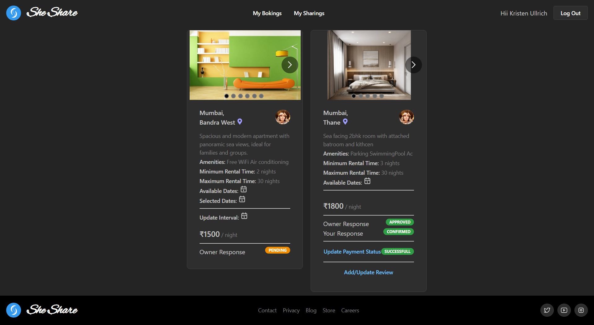
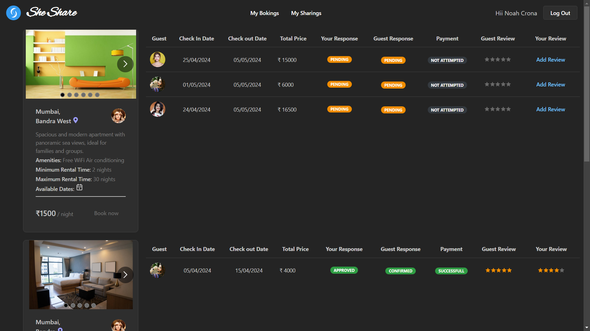

# MERN Stack Room Sharing App for Ladies

 <h1 align="center">She Share</h1> 

 🖊️ An interface for female users to share their rooma nd rent other females room. 
     This App built using <a href="https://react.dev/">React</a>, <a href="https://www.mongodb.com/">MongoDB</a>, <a href="https://expressjs.com/">ExpressJs</a>, <a href="https://nodejs.org/en/">NodeJs</a>, and <a href="http://www.passportjs.org/">PassportJS</a>

## Table of contents

-   [Features](#Features)
-   [Screenshot](#Screenshots)
-   [Built with](#built-with)
-   [Setup](#Setup)
-   [Author](#author)

## Features

-   User Authentication
-   Room Sharing Option
-   Room Renting Option
-   Search City Functionality
-   Booking Manger

## Screenshots

-   **Landing Page 1** 
    
-   **Landing Page 2** 
    
-   **Authentication Page** 
    
-   **City Search Page** 
    
-   **Share Your Room Page** 
    
-   **Book A Room Page** 
    
-   **My Bookings Page** 
    
-   **Booking Manager Page** 
    

## Built with

-   MongoDB
-   Express.js
-   React
-   Node.js
-   PassportJS (JWT & Google OAuth)
-   Mantine UI

## Setup

### Backend Setup

1. Clone the repository.
2. Navigate to the server directory: `cd server`.
3. Install backend dependencies: `npm install`.
4. Create a `.env` file to add the required information that are mentiond on /config/environment.js.
5. Start the backend server: `npm start`.

### Frontend Setup

1. Open another terminal window.
2. Navigate to the client directory: `cd client`.
3. Install frontend dependencies: `npm install --force`.
4. Create a `.env` file to add backend URL for eg. "REACT_APP_API_KEY=http://localhost:8000".
5. Start the frontend server: `npm start`.

### Viewing the Project

1. Open your browser and go to [http://localhost:3000/](http://localhost:3000/) to view the project.

## Author

-   [Subha Biswal](https://github.com/20SB)
